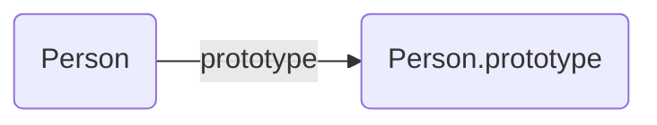
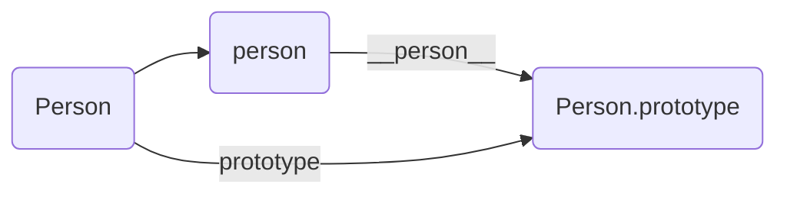
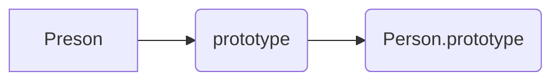
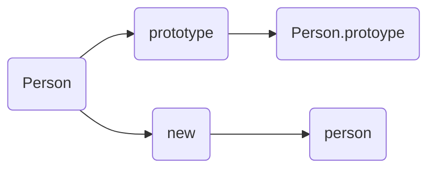
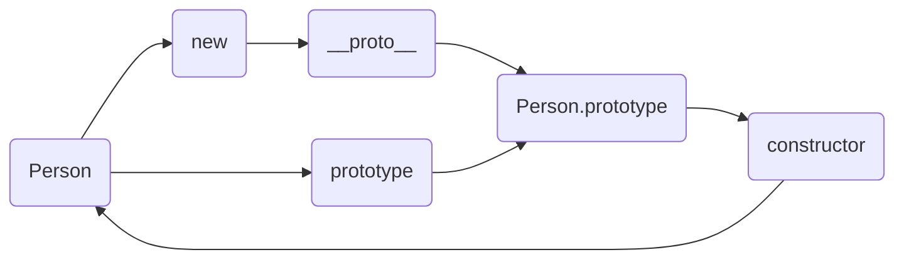
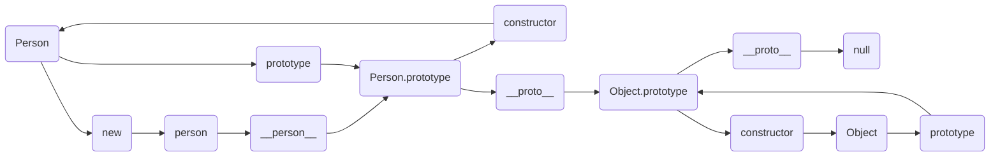

# 原型和原型链，实例，构造函数等概念之间的关系 #

## prototype ##

----------

在JavaScript中，每个函数都有一个prototype属性，这个属性指向函数的原型对象

```javascript
function Person(){}
Person.prototype.type = 'object named Person'
const person = new Person()
// person.type      "object named Person"
```

函数的prototype指向一个对象，而这个对象正是调用构造函数时创建的实例的原型，也就是person的原型

**原型的概念：每一个JavaScript对象(除nul外)创建的时候，就会与之关联另一个对象，这个对象就是我们所说的原型，每一个对象都会从原型中“继承”属性。**



## __proto__ ##

----------

每个对象(除去null外)都会有的属性，这个属性会指向该对象的原型

```javascript
function Person(){}
const person = new Person()
const res = (person.__proto__ === Person.prototype)
// res      true
```

关系图



## Constructor构造函数 ##

----------

首先，我们写一个构造函数Person，构造函数一般区别普通函数要求首字母大写

```javascript
    function Person(){}
```

## prototype原型 ##

----------

原型指的就是一个对象，实例“继承”那个对象的属性，在原型上定义的属性，通过继承，实例也拥有了这个继承属性。“继承”这个行为是在new操作符内部实现的

原型与构造函数的关系就是，构造函数内部有个prototype的属性，通过这个属性就能访问到原型**Person就是构造函数，Person.prototype就是原型**



## instance实例 ##

----------

有个构造函数，我们就可以在原型上创建可以“继承”的属性，并且用new操作符进行创建实例



我们要攒机按一个person实例，那么使用new操作符就可以实现，并通过instanceof来检查他们之间的关系

```javascript
function Person(){}
const person = new Person()
const res = person instanceof Person // true
// 检查person是否为Person的实例
```

如果我们在原型上定义一个属性，那么实例上也就可以“继承”这个属性

```javascript
function Person(){}  
Person.prototype.type = 'Object named Person'  
const person = new Person()  
const res = person.type  
// res     "Object named Person"
```

## proto隐式原型 ##

----------

实例通过 $\color{red}{\_\_proto\_\_}$ 访问到原型，所以如果是实例，那么就可以通过这个属性直接访问到原型


所以这两者是等价的

```javascript
function Person(){}
Person.prototype.type = 'object named Person'
const person = new Person()
const res = person.__proto__ === Person.prototype
//res    true
```

## constructor构造函数 ##

----------

既然构造函数通过prototype来访问到原型，那么原型也应该能够通过某种途径访问到构造函数，这就是constructor

```javascript
function Proson(){}
Person.prototype.type = 'object named Person'
const person = new Person()
const res = Person.prototype.constructor === Person
// res    true
```



**`注意这里的constructor是原型的一个属性，Construtor指的才是真正的构造函数。`**

## 实例、构造函数、原型之间的关系 ##

----------

如果想要访问构造函数，那么应当是

```javascript
function Person(){}
Person.prototype.type = 'object named Person'
const person = new Person()
const res = person.__proto__.constructor === Person
// res   true
```

没有从实例直接访问到构造函数的属性或者方法。

实例与原型则是通过上下文中提到的__proto__去访问到。在读取一个实例的属性的过程中，如果属性在该实例中没有找到，那么就会循这__proto__指定的原型上去寻找，如果找不到，则尝试寻找原型的原型

```javascript
function Person(){}
Person.prototype.type = 'object named Person'
const person = new Person()
let res = Reflect.ownKeys(person)
// res      []
res = person.type
// res      "object named Person"
```

我们尝试获取到自身属性，发现person对象并没有这个属性，所以为空.那么会通过原型链进行向上搜索，可以看到，最后打印的就是原型上的属性

如果我们给实例同名属性，那么我们尝试获取一下值

```javascript
function Person(){}
Person.prototype.type = 'object named Person'

let person = new Person()
person.type = 'object named person'

let res = Reflect.ownKeys(person)
// res      ["type"]
res = person.type
// res      "object named person"
```

## 原型链 ##

----------

原型链同样也可以通过 $\color{red}{\_\_proto\_\_}$ 访问到原型的原型，例如有个构造函数Person然后“继承”前者的一个构造函数People，然后 new People就会得到实例p
当访问p中的一个非滋有属性的时候，就会通过 $\color{red}{\_\_proto\_\_}$ 作为桥梁连接起来的一系列原型、原型的原型、原型的原型知道Object构造函数为止

这个搜索的过程的形成的链状关系就是原型链

```javascript
function Person(){}
Person.prototype.type = 'object named Person'

function People(){}
People.prototype = new Person()

const p = new People()
let res = [p instanceof Object, p instanceof Person, p instanceof People]
// res      [true, true, true]
res = p.type
// res      "object named Person"
```

图解如下



原型链偶所搜到null为止，搜不到那访问这个属性就是不存在的

```javascript
function Person(){}
Person.prototype.type = 'object named Person'

function People(){}
People.prototype = new Person()

const p = new People()
let res = p.__proto__
// res      Person {}

res = p.__proto__.__proto__
// res      {type: "object named Person", constructor: ƒ}

res = p.__proto__.__proto__.__proto__
// res      {constructor: ƒ, __defineGetter__: ƒ, __defineSetter__: ƒ, hasOwnProperty: ƒ, __lookupGetter__: ƒ, …}

res = p.__proto__.__proto__.__proto__.__proto__
// res      null
```

**实例.__proto__ == 原型**
**原型.constructor == 构造函数**
**构造函数.prototype == 原型**
